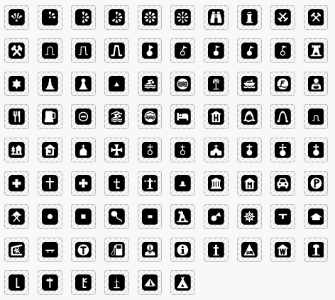

# German map symbols
This repository contains a set of adaptable symbols specially for maps of the German-speaking area. For adjustments you can use the [Mapbox maki editor](https://labs.mapbox.com/maki-icons/editor/). It was created as part of a bachelor thesis at the Institute of Cartography, Technical University of Dresden in 2021. It includes the most typical symbols from tourist maps. Each symbol is available as a 15px by 15px SVG file. In addition there is also a version of each symbol adjustable with QGIS. The set is open source and CC0 licensed. 

## Usage
Download the releases. It contains two folders, one with SVGs for the Maki edtor and another one suitable for use with QGIS. You are free to edit and redistribute the symbols. For practial reasons the set uses the CC0 Licence. Credits are always welcome: © German map symbols 2022

## Contributing
Feel free to fork and add more icons! We are happy to provide more symbols.